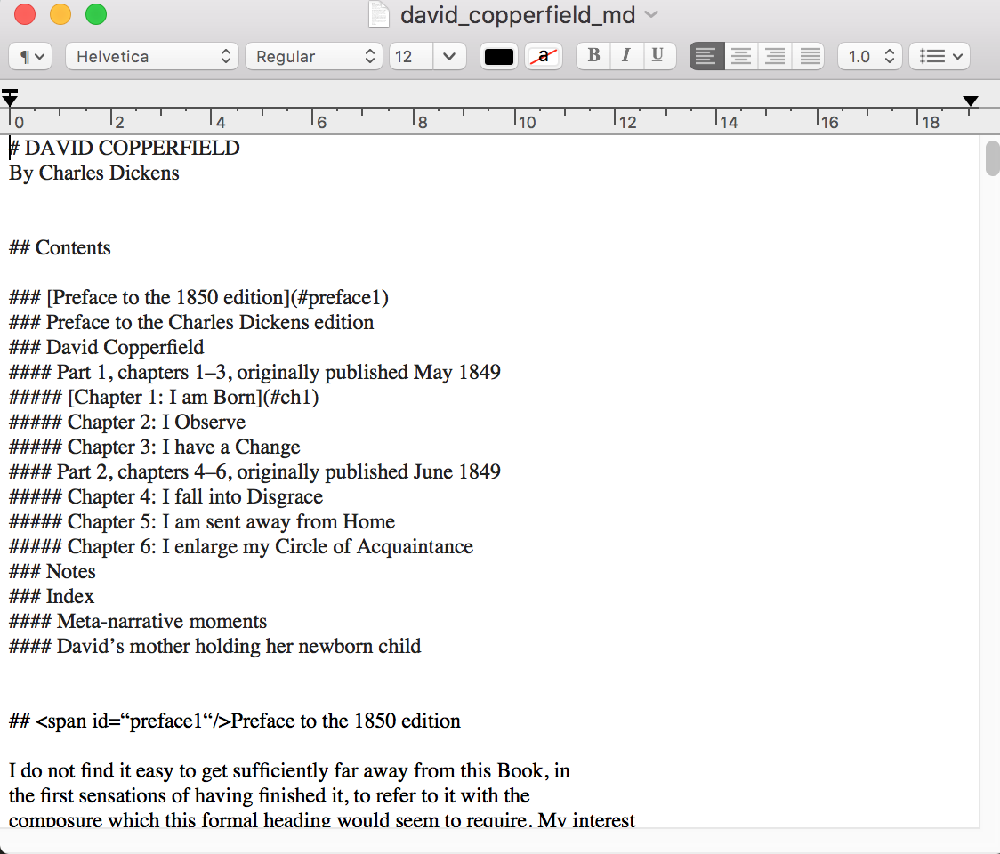
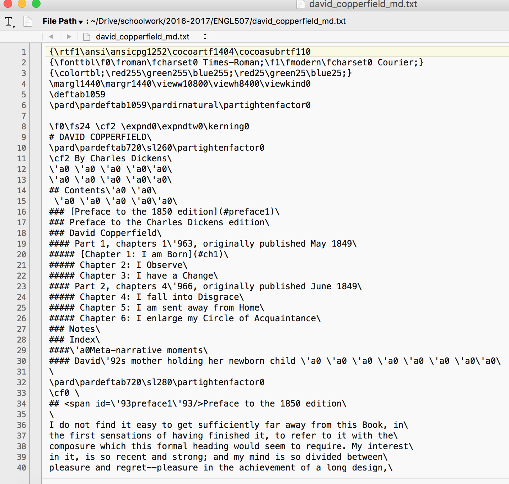
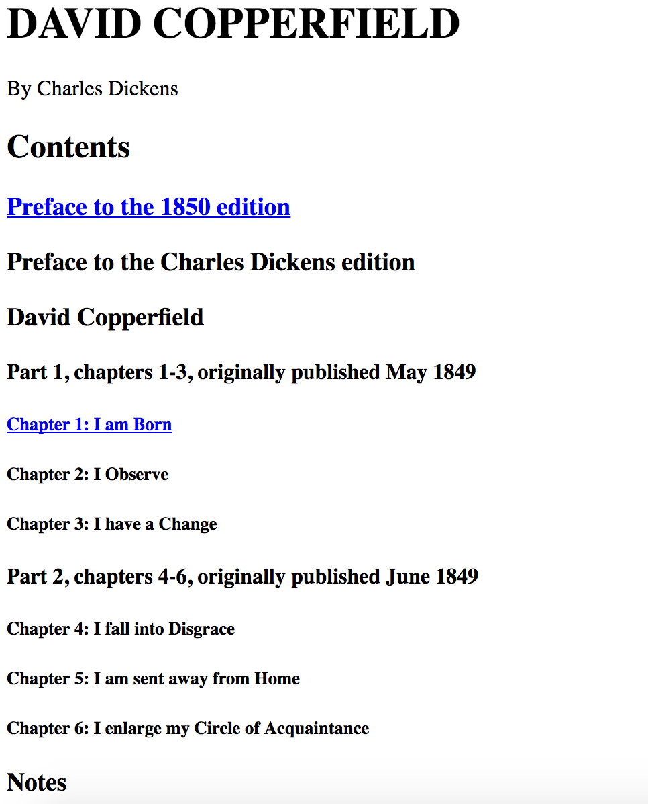
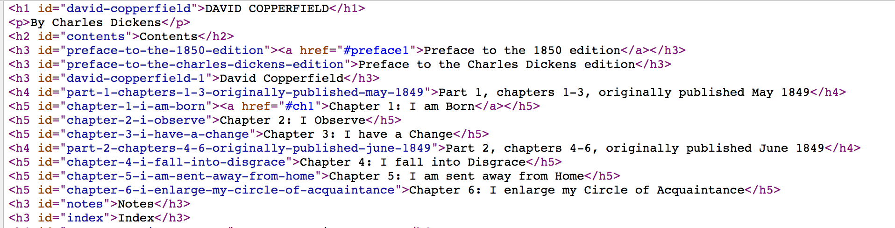

# Log

## TOC

* [May 23](#may-23)
* [May 24](#may-24)
* [May 25](#may-25)
* [May 26](#may-26)
* [May 29](#may-29)
* [May 30](#may-30)
* [May 31](#may-31)

## May 23 
**Introduction**

The introductory class spoke to some of the questions I had regarding the relationship between forms of minimalism and the digital humanities. DH is often critiqued, at least in my experience, on its reliance on awe-inspiring productions and complex features that can be seen to foreclose forms of the nuanced and close critical work that have traditionally structured literary studies. Before class, I was curious about the relationship between minimalism and practical criticism: how might minimalism be viewed as a response to the maximalist practices of distant reading and big data mining? But how might minimalism, in its impetus to strip away the extraneneous features and focus on detail, fall into similar problems as practical criticism that decades of literary criticism and theory have sought to overcome?

Alex Gil's *Ed* is an interesting project to consider in relation to these questions. *Ed* offers a framework for a "minimal edition," one that is light-weight (and thus easily archivable) as well as readable. *Ed*'s minimal aesthetic brings the design practices of other online reading resources into relief, particular the platforms that flood the text with extra information and features (I can think of many provided by the library that would be the appropriate target for *Ed*'s critique). However, readability, accessibility, and archivability in *Ed*'s articulation seems to necessitate sacrificing the long-standing and rigorous editorial practices that define grammars like the Text Encoding Initiative. The insularity of DH, at least in its genesis as Kirschenbaum's geneology explicates, is certainly an issue that ought to be addressed by opening up forms of edition building; those with the technical skills (or those who have access to people with the technical skills) required to create digital editions are certainly not the only ones who should be benefiting from the affordance of digital praxis. However, I don't think the correct solution is to obviate the need for editorial complexity by foregrounding aesthetic simplicity; instead, I would argue that the equilibrium of complexity and simplicity is what makes an edition both academically rigorous as well as accessible and archivable.

### Workshop

We made five versions of George Herbert "Easter Wings," which we found on poetry.org:

Our versions were:
* [easter-wings-1.txt](easter-wings-1.txt): regular transcription with tabs/spaces before each line (done in TextWrangler)
* [easter-wings-2.txt](easter-wings-2.txt): experiment with nesting block quotations
* [easter-wings-3.txt](easter-wings-3.txt): justified text
* [easter-wings-4.txt](easter-wings-4.txt): descending headers
* [easter-wings-5.txt](easter-wings-5.txt): ascending headers

Before we converted the text, we hypothesized:
* "Version 2 will not work, because we extrapolated from the instructions; we took the instructions and made an intuitive leap" (MC)
* "I am also wary of version 2, but I am also hesitant about version 1 as I'm not positive that while-space is fully preserved in Markdown (but maybe it is!)" (JT)

Our respective hypotheses were both more-or-less correct. V2 hadn't worked as we'd hoped originally, but we did get it to convert in the end.

Using PanDoc to convert our Markdown file was not as satisfying as I had hoped. We used both the online platform and the command line version. The major drawback to the online platform is that it gives an HTML fragment and not a well-structured document. But how could it? How can you encode header material into your Markdown document? Put another way, how can you encode information that is important to your document without it necessarily being rendered on the page? 

I was skeptical of Markdown initially. I've had to parse it many times before and each time, I end up cursing its lack of structure. But I hadn't written in it much, so the exercise was eye-opening. I can see how Markdown is far more efficient than other word processors; I particularly like how it causes the writer to focus on exactly what they're doing when they're styling their document. I'm going to try and write my log in Markdown as an exercise to see if:
* it's faster than writing in Word or other formats
* it converts as well as I'd like it to, if I need it to be in other formats (like HTML or Word)
* it enables forms of engagement with my writing that might help open up my writing process
  * I've used apps before like "[The Most Dangerous Writing App](http://www.themostdangerouswritingapp.com/)" to aid in writing seminar papers. While TMDWA is an aggressive platform that attempts to disassociate the act of writing from the act of over-thinking, Markdown can be written under any conditions and might work to disentangle the act of writing from the anxiety-inducing empty page.

## May 24
**On Functional Minimalism**

Prompt: Why would you create or want to provide a scholarly reading edition? Why would you use markdown?

This was a conversation between MC and JT about the prompt:
 
> MC: If we’re thinking about a minimalist aesthetics, it foregrounds the meaning of text--but of course the aesthetics of the “original” text has meaning already. This is the *design* part of minimalism, but in terms of the functional, computing aspects of minimalism, then the big thing is accessibility. Small file-sizes, for example. But why would we do a minimalist edition of something like *David Copperfield* or *War in Peace*...do people want that?
>
> JT: I think people would, especially those who don’t have access to the scholarly editions published by Norton, etc.  
>
> MC: Is access a problem for canonical texts like the above? One can go into a library 
>
> JT: Or purchase a $1 edition of the texts.
>
> [...]
>
> JT: My hesitation with minimal editions is this: why do we have to sacrifice editorial nuance for access? Worries about the pragmatics of the labour of marking up: it does provide jobs for students and offers a good pedagogical opportunity. 
>
> MC: Who is the audience for Ed? 
>
> JT: And what about huge corpora? 
 
### Interface Workshop
 
**Task**: Use a mockup tool to design three interfaces for the same minimalist poem, short fiction, or game of your choice.
 
**Our poem**: Shakespeare's Sonnet 73. This sonnet is about time and memory, and the last two lines are reflective on the rest of the poem.
 
#### Interface 1: Time

We spread the fourteen lines of the sonnet out vertically at increasing distances, so that a reader would need to scroll to continue reading. Eventually, the reader would experience long stretches of blank screen before arriving at the next line. Thus, time breaks are imposed on the reading experience.

")

 
#### Interface 2: Space
We separated the last two lines of the sonnet from the rest of the poem, so that the reader would need to scroll down to read the last two lines, at which point the first twelve lines would no longer be visible. Thus, the experience of reading the last two lines of the poem would be accompanied by the memory of the earlier parts of the poem, without the benefit of the lines themselves.

")
 
#### Interface 3: Annotation
We embedded annotations in the text itself, so that the annotations are stylistically indistinguishable from the poem.
 
")
 

#### Notes from class 

* Alyssa: Annotations and other scholarly apparatus are not the most accessible; operates as a textual gatekeeper. 
* Accessibility is a big focus.
* Problem of labour and how do people get *paid* for it?
  * But this is the problem with the minimal edition; if everyone can create a lightweight edition, then the pedagogical and economic opportunities for student researchers are limited. To put another way: if professors no longer feel the need to collaborate with students, where does that leave the students' labour? 
* Heavy industries: Reducing the agency of the reader; maximalist software (Flash), but minimalist aesthetics; using Flash for text
  * My favourite of today's case studies, I think. The poems work with and through time and space (to riff slightly off of Tara McPherson's article) in incredibly persuasive ways. They function as an inversion of the relationship between words and music; it is not that the lyrics do something with the music, but rather that the poetry produces sound as it appears on screen--a play between signified and signifier. 
* Expanded Cinema: integrates the audience into the work
* What can people in DH learn from visual culture? Or, what is the relationship between visual culture and DH?
  * To follow up from JS's question here: I think of W.J.T Mitchell's question, "What do pictures want?" I think we can ask the same of interfaces (I think that is what this workshop has been doing); but can we think of code or circuits as desiring? And, to continue on with thinking with Mitchell's work, is the computer or code subaltern in similar ways to other media? It's a dangerous question, particularly since computing, priviledge, and power are interlocked, especially in relation to surveillance and advertising.
* Building spaces for interaction; not interested in creating “content” but media that can be interpreted by machines; producing forms, not necessarily content; allows for the free-play of the material
  * What is the relationship between form, content, and labour? That is, how have forms (I'm thinking in the sense of fillable forms, inspired by Lisa Gitelman's work) created seemingly labourless content? Should we always be aware of the content created from the forms with which we interact? 
* Voyant: The use of the “Reveal” button; delegate responsibility of hermeneutics to the computer
  * But this is a still a "hermeneutics of suspicion" insofar as the reader is wary of their own ability to uncover what the text holds. What can a computer reveal that human readers cannot? Can code get to the truth of the text in ways that human reading? If "technologies are not neutral tools" as McPherson writes (23), then the corpora reading tools are no more revealing than human reading in terms of the balance between "objectivity" and "subjectivity."
    * Following Eve Sedgwick's work on "paranoid and reparative reading," can there be a reparative form of computing reading? Can an interface reorganize and re-align? Can interfaces queer or be queer?

## May 25
**Structural Minimalism**

#### Recap: 
 
* What did we cut out of our interface?
* We cut out “reason” or a type of legibility
* Word =/= meaning =/= action
* Assumptions? Most about the “uselessness” of the interface:
* Our base assumption is that the audience expects something useful; that interfaces are normatively or dominantly useful; that there is an assumed relation between the action word and the action itself. In sum: we made assumptions that the audience would assume something; the audience would be familiar with the genre
* The audience would understand
* The audience would appreciate
* The audience would react
* The audience would come to realize

We keep coming back to the question of *audience* and the deep forms of interaction that are enabled (but also disallowed) by minimalism.

Michael and I noticed that our base assumption was that our audience expected something useful. In other words, the audience always already demands something productive when approaching interfaces. Our interface was thus meant to trouble their normative expectations by untethering the relationship between word and meaning.

Of course, interfaces are not always useful for the audience, as the ethical AdBlocker points out. By blocking out the entire website, the ethical Adblocker calls attention to the larger structure of ads and data marketing on websites; by doing so, the projects makes a judgement about the site, one that produces a larger block of productivity and ease of movement.

### Case studies: 
 
Wave--the API is expensive...but can it be integrated into a process? What might it mean for Endings to integrate accessibility as a core concern?
 
Questions/reflection on the accessible edition workshop: the issue of value. Perhaps a paranoid critique, but how might foregrounding accessibility offer the same sort of sacrificial work that are worrying for minimal editions. What is lost in presuming the need for types of access (or what kind of hermeneutics/interpretations are we surfacing in creating these editions that foreclose other interpretations, taxonomize, etc?)

### Workshop 1:
 
**Scenario**: You’re teaching and you make your texts accessible in various formats. More important, you want to help your students navigate themes in the novels. You want to give the opportunity for the student to scan the text with those themes in mind. Design a text so students can scan it with their eyes and their ears.
 
**Process**:
* Delineate in parts and make a linked TOC
* Separate the parts by original publication dates
* Link the separate memories/associate the memories

Recalling some of the issues from the first and second workshops of the course, Michael and I worked in MarkDown to create out accessible edition. We took data from the Gutenberg project's text version of *David Copperfield* and created a linked table of contents that would allow for quick navigation of the text. 

Above is our version of the text in "MarkDown"; I use quotation marks here since this is not encoded in MarkDown. We worked in TextEdit, which, by default, outputs text in RTF. When we attempted to convert it using PanDoc, we realized the wealth of underlying encoding that was driving the TextEdit interface and thus interrupting our conversion process.

We rewrote the text so that it was in pure MarkDown ([here](dc.txt))and then converted it to this:

[Source file](dc.html)

### Workshop 2: 
 
An edition faithful to temporality: A Temporary Memory analepsis/prolepsis
 
One table of contents: 
The structural elements of the text
Grouped by original publication dates
 
TOC 2: 
Index of internal reference
 
Theme/trope:
Meta-moments, p17, ‘I remember this blah…’ 

Workshop 3: Designing an exhibit
 
Select a collection of materials
Identify a theme (or exhibit title) for navigating the theme
Select a space on campus
Detail + sketch: [tactile, digital, both?]
Materials and their location
Descriptions and their location
Curatorial decisions and their location
 
Joy Kogawa stuff at UBC.
Determining the proper stairs to put the exhibit; the geography of the disciplines in Clearihue
Negotiation, interface
What kind of experience are they supposed to have? 
 
 
Maps of BC in varying states going throughout the ceiling things
And then just small bits of text with explanatory materials beside
 
IDEAS:
Digital Photo Frame
QR Code [commercialization?]
Dead drops
 
 
 

 
 

## May 26

Class today is 
### Notes
* Picking back up from yesterday.
* Questions of access--and the everyday
* Thinking about context, embodiment, access, modalities
* Tactile and lived experiences for audiences
* Navigation relies on seeing, vision, movement, touch
* Designs in use, rather than design in ideal
* How people use the space prior to installation
* Functional: use and features; structural: engagement, habit
 
* Visualization is tied to quantitative graphical representation
* Treating data is a resource; the points are tangible
* Johanna Drucker and Gittleman: All data are cooked; there is no raw data. And that all data (or capta) are produced
* Flatness--how to make it more robust, and to think with it rather than consider it as proof
* Data visualization as an art form
* What happens when you flatten material so that people can navigate it? To what ends?
* “How do we engage modularization, responsibility?” 
  * This question is particularly thought-provoking for me. I hadn't thought of how responsibility and accountability function in the context of the digital. I'm unsure, though, about how networking, importing, and "calling" other modules allows or forecloses a more distributed sense of responsibility. Here I think of new materialist and posthumanist considerations of accountability, particularly Donna Haraway's recent *Staying with the Trouble* (2016). Haraway urges us to let go of the concept of the Anthropocene ("sky gazing homo" [8]) and consider our epoch that of the Chthonic ones (which, interestingly, is the Greek for "of the earth" and has etymological ties with the autochthonous). This shift moves from thinking about centering responsibility and distributing across varying scales to think of the tentacularity (her term) of accountability. I think rethinking this move of distributed responsibility in light of programmatic modularity and function calls highlights the *dangers* of distributed accountability. Is it the compiler, the main program's programmer, the module developer who is culpable for the negative effects of code? Or is it in the "intra-action" (Barad) of the code fragments that responsibility is simultaneously produced and distributed? 

### Visualization Workshop
 
Terms and classifications:

What are the kind of standards and ontologies at work in the visualizations you see in a digital project?
 
* Think of 5 relations
* 3 ways that you would visualize ‘edge-significance’ 
* Example: https://linkedjazz.org/ontology-building-for-linked-open-data-a-pragmatic-perspective/

For this workshop, MC and I created an ontology for the study of Hardy criticism. 

## May 29

I missed this day, so I wasn't able to take advantage of the workshop. However, I do want to think through the question posed on the syllabus for today through the case studies:

> How, then, do we engage facilitation and its assumptions through design as inquiry?

To begin, I want to ask what Shelley Jackson's "my body - a Wunderkammer" makes easier or enables for the reader, if anything. A series of prose poems mapped out on the artist's rendering of the body, the project examples the ways in which the hypertext poem challenges the ease of the reading experience. The poems are linked both through links made on the artistic body and linked encoded within the HTML `<body/>` of the document. In doing so, Jackson's series resists linear narrative and normative interpretive techniques. In doing so, the project asks more from the reader, demanding particular attention to keep track of all of the poetic series' parts.

In taking away the restrictions of the physical book, Jackson's poem does open up ways to engage with the work in creative ways. However, the series is also one that demands the labour of the reader; it asks us to read, trace, and follow the text throughout the site, which requires significant mental and interpretive labour. To thi  

## May 30

### Design brief (2-3 pages):
* Working title
* Tagline
* Type
* Concept/Function
* Description
* Purpose
* Domain (period, genre, etc)
* Structure
* Scope
* Recipe
* Aesthetic
* Biases
* Influences

### Working Design Brief

**Working title**:
 The Public TRC

**Tagline**:
 ???

**Type**: 
A digital edition / a toolset for doing similar work

**Concept/function**:
To have a minimal but rigorously encoded version of the TRC for preservation in archives as well as text analysis work; hopefully, this could be forked on GitHub so that people could create similarly made minimal editions.

**Description**:
Creating an accessible version of the TRC with companion TEI and TXT files. 

**Purpose**:
So that the TRC can be "unlocked" from its PDF form; be edited and preserved in a language that outlasts PDF (and is smaller); is subject to critique through text analysis tools; can be owned and distributed, rethought, and worked with by others. (Explanation not necessary but: right now, most of the TRC documents are either in print OR hosted by a for-profit web design company called "My Robust.")

**Domain**:
Contemporary

**Structure**: 
A website on GitHub with a build/distribution

**Scope**:
My project's scope will feature the summary report, which contains survivor testimony, calls to action, and hisorical background (basically just a condensed version of the other reports).

**Recipe**:
Build process that:
* Splits PDFs,
* Turns it into PNGs
* Uses tesseract (open-source) to create HOCR (near HTML files of the PDFs)
* Use a conversion from HOCR --> TEI
* Edit the TEI and do some light encoding that will be necessary for this to be a rich text
* Create a version of the TRC that is
  * Readable, scannable, searchable, "minable", etc. 

**Aesthetic**: 
"Ed"-esque, but without Jekyll. Pure TEI --> HTML using XSLT (and maybe some BASH scripting)

**Biases**:
* That people want this
* That PDFs are not incredibly sustainable, easily corruptable, design oriented rather than textually significant
* This is thus a slight critique of design *for design's sake* rather than the relationship between design and function

**Influences**: 
* Digital editing projects, as well as Ed...but in critique of Ed as the necessity for simplicity
* The larger sort of /dist/ here is that the code can be forked to be used for any multipage PDFs to turn into TEI and then accessible HTML. The problem, however, is that it will necessarily need to be customizable. 

**TO READ**:
Sterne's MP3 book; why format studies are important

## May 31

### Presentations

#### Heidi + Rachel

* Highlighting the passive voice
* Transparency and accessibility
* Web browser plug-in
* Q: Is the passive voice political, or it is simply bad writing?
* Outcome: to promote the crtiical consumption of media, and for users to encourage others to do the same
* Uses:
  * Pedagogical Tool
  * Affect studies
  * Implement confidence ratings

#### Alyssa

* Working on Richard Siken's "Ghost, Zero, Suitcase, and the Moon" from *War of the Foxes*
* Working with flash, audacity
* Using computer to reimagine form to comment on the content
* Relationship between "aesthetic image" and ability; dis/in/ability in minimal DH
* As a tool for elucidaition
* Computer as a device for remediation
* As a redux and summary of the course

#### Riley

* Title: *Ulysses* through time
* Physical exhibit that traces the publication history of *Ulysses* through time
* Hopefully a live exhibit, but might need to be a mockup (time, resources, availability, etc)
* Audience: The UVic community and the literary public
* Not addressing current criticism about the work; only criticism contemporary to the work
* SC might not have all of the editions; it becomes edition
* How can the exhibit go beyond the visual and the mobile?

#### Luke

* Wordchipper:
  * Breaks up texts into words and replaces parts of speech from another text
  * Dictional minimalism
* Written in Python and Javascript
* What other applications? 

#### Brooke

* Focus on the connections between the Romantics
* Inspired by Linked Jazz and *Young Romantics: The Tangled Lives of English Poetry's Greatest Generation* by Daisy Hay
* Except, Linked Jazz has a figure at the center; not wanting a central person in the prototype
* Each person: 
  * Photo
  * Bio
  * Connective line [text, image, ???]
* The time that the work was done
* The type of relationship
  * With a wide variety of non-mutually-exclusive relationships
* Using Palladio and a CSV (it's an interesting way to create this sort of visualization)
* Who deems the necessary info that people want?
  * You could have selectors on the side
* Filetype would be spreadsheets

#### Rachel

* Title: NOTES TO MY MUSE, *in sonic flesh*
* A sonic melding of WC lesbian poets (Chrystos, Betsy Warland, Daphne Marlatt), the A LOT archive @ SFU, and her own monograph
* [[This is very interesting, particularly in relation to theories of affect. Eve Sedgwick's work in *Touching, Feeling*, particularly her work on "texture" is interesting]]
* Influences: Hayley Newman, "Microphone Skirt"; Kaffe Mathews, "Music for Bodies"; Peaches; Anaïs Nin
* What sort of harmonies/cacophonies are you trying to strike in this project? Thinking about Chrystos being associated with Riot Grrrrl?
* The relationship between bodies and sound and affect and technology? 

#### Michael

* Title: "In Dialogue: Thomas Hardy's *The Woodlanders* and the French Impressionists"
* Pairing French impressionist paintings with quotations from Hardy
* Using evidence to make the connection, but not making any claim about the connection (no causality)

#### Hector / Reuben

* Norman "The Mauler" Mailer
* Humanizing the author
* How can we address the problems of accessibility?
* How to indicate curatorial decisions?
* What is your scope?
  * Might just be around Norman Mailer 

#### My Presentation

* Notes: Readability: chapters, TOC.

### Feedback:

#### Michael

I think your project would be useful to the following people:

1) Anyone interested in the contents of the TRC. I think your project does a good job of not taking a stance on the TRC except to implicitly argue that it ought to be widely accessible, so hopefully the project would interest anyone who was already interested in the document itself, for whatever reason.

2) Anyone interested in how government documents are circulated and preserved. Maybe people will look at your project and think that other documents, such the constitution or the criminal code, should be made available to the public in a similar form. Or maybe people will feel the reverse: that documents such as the TRC should follow existing procedures for circulating government documents digitally and not be circulated in new forms.

3) Anyone interested how to engage the public with issues like those in the TRC. You made a really interesting point in your presentation, that you don't want the TRC to turn into some kind of "book club" reading material that everyone is encouraged to read and discuss in a possibly superficial way. I think that one of the challenges of your project will be to figure out how to encourage more thoughtful discussion, and I appreciated that you were clearly aware of that challenge.

#### Rachel

Joey's nuanced presentation highlighted the planning of a project that could obviously be of use to researchers and/or government officials who are seeking to glean information from or more broadly work with the TRC. I was compelled by the ingenuity and craftiness of Joey's proposed project, which is clearly needed as a tool to parse the TRC documents effectively and efficiently. Such a tool, I mentioned to Joey in conversation, could be marketed for personal use once completed. 

#### Reflection on feedback

It is interesting to see the parts of the project that the separate reviewers took away from my presentation. I particularly think one of the most exciting parts of the project will be how it interacts with the existing forums for reading the TRC, namely the the National Center for Truth and Reconciliation as well as social media.

One thing that I should clarify in my documentation is that the code I am using *is* adaptable, but it likely won't be that exciting for others since there are a variety of better tools for parsing PDF documents into XHTML5. Each have their drawbacks, but if someone wants to turn a PDF into an HTML page, there is code that works much faster and more intuitively. The advantage of my project, I hope, is that it will model a workflow for creating light-weight, minimal, and well-encoded documents.

To speak to Michael's concern about facilitating conversation about the TRC: my hope is that my interface strips away some of the argumentation about the TRC other than foregrounding its cultural importance. The implicit side that the project takes is that it's a document that ought to be read widely and considered deeply. But my aim isn't to render the text skeptically; instead, I hope that design of the site will allow the text to be considered as text.

