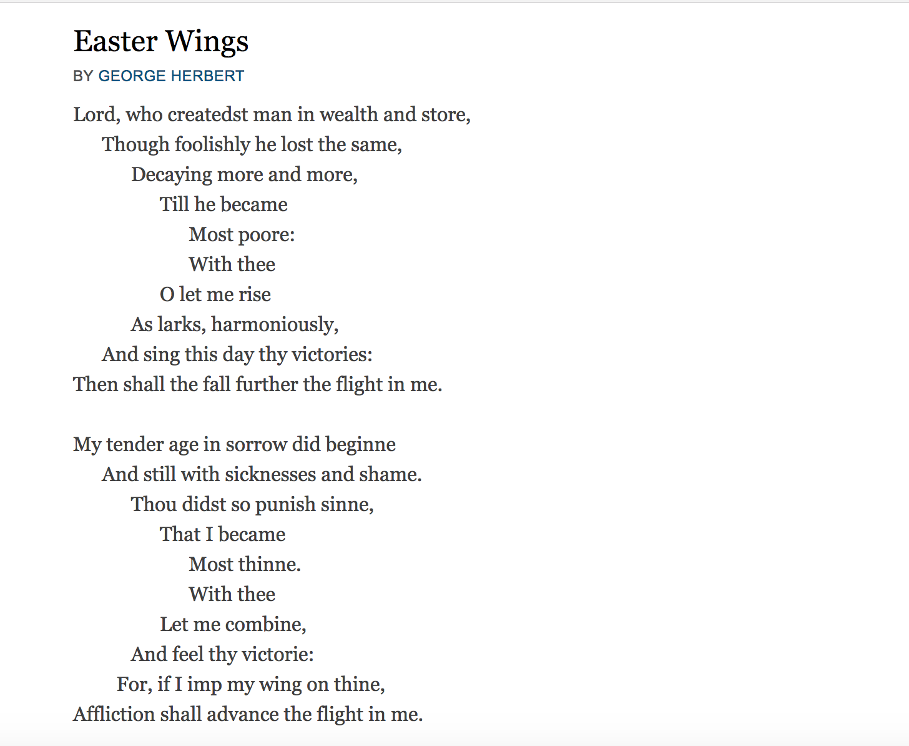

# Log

## TOC

* [May 23](#may-23)
* [May 24](#may-24)
* [May 25](#may-25)
* [May 26](#may-26)
* [May 29](#may-29)
* [May 30](#may-30)
* [May 31](#may-31)

## May 23 

The introductory class spoke to some of the questions I had regarding the relationship between forms of minimalism and the digital humanities. DH is often critiqued, at least in my experience, on its reliance on awe-inspiring productions and complex features that can be seen to foreclose forms of the nuanced and close critical work that have traditionally structured literary studies. Before class, I was curious about the relationship between minimalism and practical criticism: how might minimalism be viewed as a response to the maximalist practices of distant reading and big data mining? But how might minimalism, in its impetus to strip away the extraneneous features and focus on detail, fall into similar problems as practical criticism that decades of literary criticism and theory have sought to overcome?

Alex Gil's *Ed* is an interesting project to consider in relation to these questions. *Ed* offers a framework for a "minimal edition," one that is light-weight (and thus easily archivable) as well as readable. *Ed*'s minimal aesthetic brings the design practices of other online reading resources into relief, particular the platforms that flood the text with extra information and features (I can think of many provided by the library that would be the appropriate target for *Ed*'s critique). However, readability, accessibility, and archivability in *Ed*'s articulation seems to necessitate sacrificing the long-standing and rigorous editorial practices that define grammars like the Text Encoding Initiative. The insularity of DH, at least in its genesis as Kirschenbaum's geneology explicates, is certainly an issue that ought to be addressed by opening up forms of edition building; those with the technical skills (or those who have access to people with the technical skills) required to create digital editions are certainly not the only ones who should be benefiting from the affordance of digital praxis. But I do think it is

I was skeptical of Markdown initially. I've had to parse it many times before and each time, I end up cursing its lack of structure. But I hadn't written in it much, so the exercise was eye-opening. I can see how Markdown is far more efficient than other word processors; I particularly like how it causes the writer to focus on exactly what they're doing when they're styling their document. I'm going to try and write my log in Markdown as an exercise to see if:
* it's faster than writing in Word or other formats
* it converts as well as I'd like it to, if I need it to be in other formats (like HTML or Word)
* it enables forms of engagement with my writing that might help open up my writing process
  * I've used apps before like "[The Most Dangerous Writing App](http://www.themostdangerouswritingapp.com/)" to aid in writing seminar papers. While TMDWA is an aggressive platform that attempts to disassociate the act of writing from the act of over-thinking, Markdown can be written under any conditions and might work to disentangle the act of writing from the anxiety-inducing empty page.

### Workshop

We made five versions of George Herbert "Easter Wings," which we found on poetry.org:

Our versions were:
* [easter-wings.txt](easter-wings.txt): regular transcription with tabs/spaces before each line (done in TextWrangler)
* [easter-wings-2.txt](easter-wings-2.txt): experiment with nesting block quotations
* [easter-wings-3.txt](easter-wings-3.txt): justified text
* [easter-wings-4.txt](easter-wings-4.txt): descending headers
* [easter-wings-5.txt](easter-wings-5.txt): ascending headers

Before we converted the text, we hypothesized:
* "Version 2 will not work, because we extrapolated from the instructions; we took the instructions and made an intuitive leap" (MC)
* "I am also wary of version 2, but I am also hesitant about version 1 as I'm not positive that while-space is fully preserved in Markdown (but maybe it is!)" (JT)

Our respective hypotheses were both more-or-less correct. V2 hadn't worked as we'd hoped originally, but we did get it to convert in the end.

Using PanDoc to convert our Markdown file was not as satisfying as I had hoped. We used both the online platform and the command line version. The major drawback to the online platform is that it gives an HTML fragment and not a well-structured document. But how could it? How can you encode header material into your Markdown document? Put another way, how can you encode information that is important to your document without it necessarily being rendered on the page? 

The other feature of the Markdown to HTML conversion through PanDoc is the lack of hierarchy. Michael and I struggled for quite a while to get the nested features of Gerald Manly Hopkin's "Easter Wings" to render correctly. Header levels worked nicely, but nested quotations were difficult to work out.

## Before conversion

Hypothesis (MC): version 2 will not work, because we extrapolated from the
instructions; we took the instructions and made an intuitive leap. 
Hypothesis (JT): I too am wary of version 2, but I am also slightly hesitant about version 1
as I'm not positive that white-space is fully preserved in markdown (but maybe it is!). 

[[Add image here]]

## May 24

### Reflection

### Workshop

### Questions

Prompt: Why would you create or want to provide a scholarly reading edition? Why would you use markdown?
 
MC: If we’re thinking about a minimalist aesthetics, it foregrounds the meaning of text--but of course the aesthetics of the “original” text has meaning already. This is the *design* part of minimalism, but in terms of the functional, computing aspects of minimalism, then the big thing is accessibility. Small file-sizes, for example. But why would we do a minimalist edition of something like David Copperfield or War in Peace...do people want that?
 
JT: I think people would, especially those who don’t have access to the scholarly editions published by Norton, etc. 
 
MC: Is access a problem for canonical texts like the above? One can go into a library
 
JT: Or purchase a $1 edition of the texts.
 
[...]
 
JT: My hesitation with minimal editions is this: why do we have to sacrifice editorial nuance for access? Worries about the pragmatics of the labour of marking up: it does provide jobs for students and offers a good pedagogical opportunity. 
 
MC: Who is the audience for Ed? 
 
And what about huge corpora? 
 
## Notes from class 
 
Alyssa: Annotations and other scholarly apparatus isn’t the most accessible; operates as a textual gatekeeper. 
 
Accessibility is a big focus.
 
Problem of labour and how do people get *paid* for it?
 
JS: Why not have a layer? 
 
** JT to ask projects: can we create plain-text versions of our primary sources [or everything, I suppose]; easier for digesting texts and doing text-analysis through tools like Voyant
 
Heavy industries: Reducing the agency of the reader; maximalist software (Flash), but minimalist aesthetics; using Flash for text
 
Expanded Cinema: integrates the audience into the work
 
What can people in DH learn from visual culture (or what is the relationship between visual culture and DH?)
 
Building spaces for interaction; not interested in creating “content” but media that can be interpreted by machines; producing forms, not necessarily content; allows for the free-play of the material
 
Galloway: diegetic and non-diegetic machine operations
 
LISP: Minimal syntax that encourages use.
 
Programming language as minimalist?
 
Voyant: The use of the “Reveal” button; delegate responsibility of hermeneutics to the computer
 
### Interface Workshop
 
Task: Use a mockup tool to design three interfaces for the same minimalist poem, short fiction, or game of your choice.
 
Our poem: Shakespeare's Sonnet 73. This sonnet is about time and memory, and the last two lines are reflective on the rest of the poem.
 
Interface 1: Time
We spread the fourteen lines of the sonnet out vertically at increasing distances, so that a reader would need to scroll to continue reading. Eventually, the reader would experience long stretches of blank screen before arriving at the next line. Thus, time breaks are imposed on the reading experience.
 
Interface 2: Space
We separated the last two lines of the sonnet from the rest of the poem, so that the reader would need to scroll down to read the last two lines, at which point the first twelve lines would no longer be visible. Thus, the experience of reading the last two lines of the poem would be accompanied by the memory of the earlier parts of the poem, without the benefit of the lines themselves.
 
Interface 3: Annotation
We embedded annotations in the text itself, so that the annotations are stylistically indistinguishable from the poem.
 
 
Interrogating the relationship between interface and content; what is the function of the text?
 
One more interface per text: choose your own interface/framework
	Think about content and interface relations
	Function (functional minimalism)
	Actual wireframe to show

## May 25

We keep coming back to the question of *audience* and the deep forms of interaction that are enabled (but also disallowed) by minimalism.

Michael and I noticed that our base assumption was that our audience expected something useful. In other words, the audience always already demands something productive when approaching interfaces. Our interface was thus meant to trouble their normative expectations by untethering the relationship between word and meaning.

Of course, interfaces are not always useful for the audience, as [[case study of the adblocker thing]] points out.

Workshop 3: Designing an exhibit
 
Select a collection of materials
Identify a theme (or exhibit title) for navigating the theme
Select a space on campus
Detail + sketch: [tactile, digital, both?]
Materials and their location
Descriptions and their location
Curatorial decisions and their location
 
Joy Kogawa stuff at UBC.
Determining the proper stairs to put the exhibit; the geography of the disciplines in Clearihue
Negotiation, interface
What kind of experience are they supposed to have? 
 
 
Maps of BC in varying states going throughout the ceiling things
And then just small bits of text with explanatory materials beside
 
IDEAS:
Digital Photo Frame
QR Code [commercialization?]
Dead drops
 
 
 
Workshop 2: 
 
An edition faithful to temporality: A Temporary Memory analepsis/prolepsis
 
One table of contents: 
The structural elements of the text
Grouped by original publication dates
 
TOC 2: 
Index of internal reference
 
Theme/trope:
Meta-moments, p17, ‘I remember this blah…’ 
 
 
Workshop 1:
 
Scenario: You’re teaching and you make your texts accessible in various formats. More important, you want to help your students navigate themes in the novels. You want to give the opportunity for the student to scan the text with those themes in mind. Design a text so students can scan it with their eyes and their ears.
 
Wave validator: Investigating digital projects in dhcommons, but also investigating MoEML: structural issues of no “alt-text.”
 
Scanning happens through structural or semantic data in a website
 
 
Delineate in parts and make a linked TOC
Separate the parts by original publication dates
Link the separate memories/associate the memories
 
 
Case studies: 
 
Wave--the API is expensive...but can it be integrated into a process? What might it mean for Endings to integrate accessibility as a core concern?
 
Questions/reflection on the accessible edition workshop: the issue of value. Perhaps a paranoid critique, but how might foregrounding accessibility offer the same sort of sacrificial work that are worrying for minimal editions. In other words, what is lost in presuming the need for types of access (or what kind of hermeneutics/interpretations are we surfacing in creating these editions that foreclose other interpretations, taxonomize, etc?)
 
Recap: 
 
What did we cut out of our interface?
We cut out “reason” or a type of legibility
Word =/= meaning =/= action
Assumptions? Most about the “uselessness” of the interface:
Our base assumption is that the audience expects something useful; that interfaces are normatively or dominantly useful; that there is an assumed relation between the action word and the action itself. In sum: we made assumptions that the audience would assume something; the audience would be familiar with the genre
The audience would understand
The audience would appreciate
The audience would react
The audience would come to realize

## May 26

Picking back up from yesterday.
Questions of access--and the everyday
Thinking about context, embodiment, access, modalities
Tactile and lived experiences for audiences
Navigation relies on seeing, vision, movement, touch
Designs in use, rather than design in ideal
How people use the space prior to installation
Functional: use and features; structural: engagement, habit
 
Visualization Workshop
 
Terms and classifications
What are the kind of standards and ontologies at work in the visualizations you see in a digital project?
Think through a concept model 
 
Think of 5 relations
3 ways that you would visualize ‘edge-significance’ 
Example: https://linkedjazz.org/ontology-building-for-linked-open-data-a-pragmatic-perspective/
 
Visualization is tied to quantitative graphical representation
Treating data is a resource; the points are tangible
Johanna Drucker and Gittleman: All data are cooked; there is no raw data. And that all data (or capta) are produced
Flatness--how to make it more robust, and to think with it rather than consider it as proof
Data visualization as an art form
What happens when you flatten material so that people can navigate it? To what ends?
“How do we engage modularization, responsibility?” 
 
Working with Python: how might responsibility be distributed across modules, functions, etc? (Does Python distinguish between public and private class like Java?)

## May 29

[[Missed this day, so will have to write things about]]

## May 30

### Design brief (2-3 pages):
* Working title
* Tagline
* Type
* Concept/Function
* Description
* Purpose
* Domain (period, genre, etc)
* Structure
* Scope
* Recipe
* Aesthetic
* Biases
* Influences

### Working Design Brief

**Working title**:
 The Public TRC

**Tagline**:
 ???

**Type**: 
A digital edition / a toolset for doing similar work

**Concept/function**:
To have a minimal but rigorously encoded version of the TRC for preservation in archives as well as text analysis work; hopefully, this could be forked on GitHub so that people could create similarly made minimal editions.

**Description**:
Creating an accessible version of the TRC with companion TEI and TXT files. 

**Purpose**:
So that the TRC can be "unlocked" from its PDF form; be edited and preserved in a language that outlasts PDF (and is smaller); is subject to critique through text analysis tools; can be owned and distributed, rethought, and worked with by others. (Explanation not necessary but: right now, most of the TRC documents are either in print OR hosted by a for-profit web design company called "My Robust.")

**Domain**:
Contemporary

**Structure**: 
A website on GitHub with a build/distribution

**Scope**:
My project's scope will feature the summary report, which contains survivor testimony, calls to action, and hisorical background (basically just a condensed version of the other reports).

**Recipe**:
Build process that:
* Splits PDFs,
* Turns it into PNGs
* Uses tesseract (open-source) to create HOCR (near HTML files of the PDFs)
* Use a conversion from HOCR --> TEI
* Edit the TEI and do some light encoding that will be necessary for this to be a rich text
* Create a version of the TRC that is
  * Readable, scannable, searchable, "minable", etc. 

**Aesthetic**: 
"Ed"-esque, but without Jekyll. Pure TEI --> HTML using XSLT (and maybe some BASH scripting)

**Biases**:
* That people want this
* That PDFs are not incredibly sustainable, easily corruptable, design oriented rather than textually significant
* This is thus a slight critique of design *for design's sake* rather than the relationship between design and function

**Influences**: 
* Digital editing projects, as well as Ed...but in critique of Ed as the necessity for simplicity
* The larger sort of /dist/ here is that the code can be forked to be used for any multipage PDFs to turn into TEI and then accessible HTML. The problem, however, is that it will necessarily need to be customizable. 

**TO READ**:
Sterne's MP3 book; why format studies are important

## May 31

### Presentations

#### Heidi + Rachel

* Highlighting the passive voice
* Transparency and accessibility
* Web browser plug-in
* Q: Is the passive voice political, or it is simply bad writing?
* Outcome: to promote the crtiical consumption of media, and for users to encourage others to do the same
* Uses:
  * Pedagogical Tool
  * Affect studies
  * Implement confidence ratings

#### Alyssa

* Working on Richard Siken's "Ghost, Zero, Suitcase, and the Moon" from *War of the Foxes*
* Working with flash, audacity
* Using computer to reimagine form to comment on the content
* Relationship between "aesthetic image" and ability; dis/in/ability in minimal DH
* As a tool for elucidaition
* Computer as a device for remediation
* As a redux and summary of the course

#### Riley

* Title: *Ulysses* through time
* Physical exhibit that traces the publication history of *Ulysses* through time
* Hopefully a live exhibit, but might need to be a mockup (time, resources, availability, etc)
* Audience: The UVic community and the literary public
* Not addressing current criticism about the work; only criticism contemporary to the work
* SC might not have all of the editions; it becomes edition
* How can the exhibit go beyond the visual and the mobile?

#### Luke

* Wordchipper:
  * Breaks up texts into words and replaces parts of speech from another text
  * Dictional minimalism
* Written in Python and Javascript
* What other applications? 

#### Brooke

* Focus on the connections between the Romantics
* Inspired by Linked Jazz and *Young Romantics: The Tangled Lives of English Poetry's Greatest Generation* by Daisy Hay
* Except, Linked Jazz has a figure at the center; not wanting a central person in the prototype
* Each person: 
  * Photo
  * Bio
  * Connective line [text, image, ???]
* The time that the work was done
* The type of relationship
  * With a wide variety of non-mutually-exclusive relationships
* Using Palladio and a CSV (it's an interesting way to create this sort of visualization)
* Who deems the necessary info that people want?
  * You could have selectors on the side
* Filetype would be spreadsheets

#### Rachel

* Title: NOTES TO MY MUSE, *in sonic flesh*
* A sonic melding of WC lesbian poets (Chrystos, Betsy Warland, Daphne Marlatt), the A LOT archive @ SFU, and her own monograph
* [[This is very interesting, particularly in relation to theories of affect. Eve Sedgwick's work in *Touching, Feeling*, particularly her work on "texture" is interesting]]
* Influences: Hayley Newman, "Microphone Skirt"; Kaffe Mathews, "Music for Bodies"; Peaches; Anaïs Nin
* What sort of harmonies/cacophonies are you trying to strike in this project? Thinking about Chrystos being associated with Riot Grrrrl?
* The relationship between bodies and sound and affect and technology? 

#### Michael

* Title: "In Dialogue: Thomas Hardy's *The Woodlanders* and the French Impressionists"
* Pairing French impressionist paintings with quotations from Hardy
* Using evidence to make the connection, but not making any claim about the connection (no causality)

#### Hector / Reuben

* Norman "The Mauler" Mailer
* Humanizing the author
* How can we address the problems of accessibility?
* How to indicate curatorial decisions?
* What is your scope?
  * Might just be around Norman Mailer 

#### My Presentation

* Readability: chapters, TOC.

### Workshop

* Pair up organically with two other people to peer-review
* Persona design
* Make sure the feedback is in your log

### Michael's Feedback

* Not a passive reading

